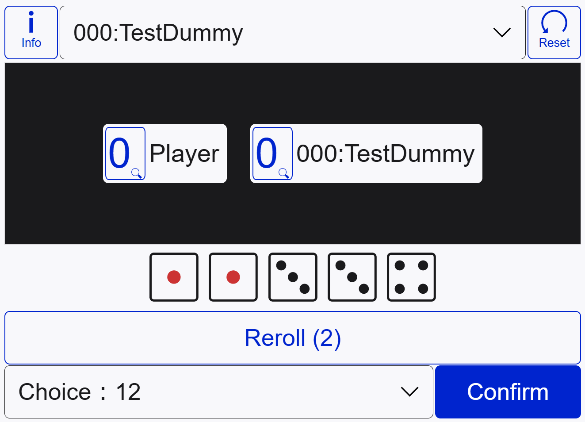

# FUNE

このリポジトリは、ヨットライクのダイスゲーム「フネ」を扱っております。ゲーム自体は、Web上で遊ぶことができます。

## 遊び方

リンクより、ブラウザ上で遊ぶことができます。ゲームの説明については、下記を参照ください。

- [How to play this game (EN)](./notes/how-to-play-en.md)
- [遊び方 (JP)](./notes/how-to-play-ja.md)

## 特徴

### PWA

デバイスに登録し、遊ぶことができます。

### レスポンシブデザイン

様々なデバイス上で遊ぶことができます。

<figure>
  
  <figcaption>横画面時</figcaption>
</figure>

<figure>
  
  <figcaption>縦画面時</figcaption>
</figure>

### アクセシビリティ

キー操作、スクリーンリーダーで動作できることを目指しています。
また、フォントサイズやカラーモードなど、デバイス上の設定を使って適切なレイアウトになるようにしてます（手動でも変更可能）

### 敵戦略の追加

現状、スコア配列を用意できれば敵を追加することができます。詳しくは for-dev.md を参照してください。
