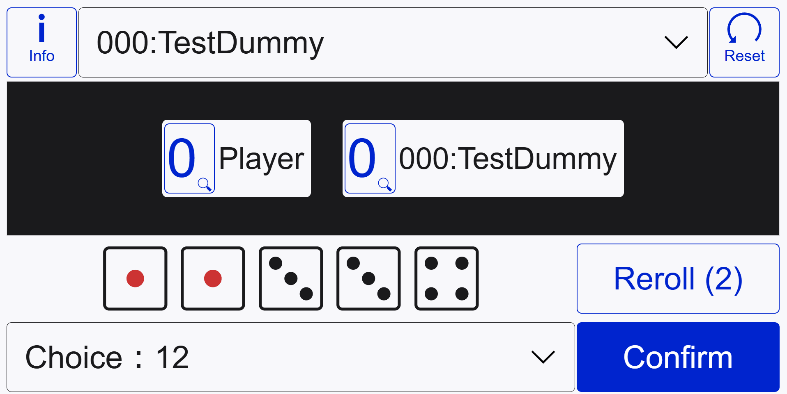

# FUNE

This repository is the game based on the public domain dice game **Yacht**. Other similar games include **Yahtzee**, **Yatzy** and **Poker dice**. This game can be played on the web.

This `README` is in English, the **Japanese version** is [here](./README-ja.md).

## How to play

You can play in your browser from [this link](./)(Japanese version is [here](./)). Please see below for a description of the game flow and combinations.

- [How to play this game (EN)](./notes/how-to-play-en.md)
- [遊び方(JP)](./notes/how-to-play-ja.md)

## Features

### PWA(Progressive Web App)

It can be installed on devices as a PWA.

### Accessibility

The game can be played on any device and in any screen orientation.

Landscape mode

Portrait mode

It also uses device settings such as `font-size` and `color-mode` to ensure an appropriate layout (These can also be changed manually).

Furthermore, I aim to make it possible to operate the game with a keyboard and screen reader.

### Enemy strategy

If you can prepare a `score array`, you can change or add opponent behavior. Please refer to [for-developer-ja.md(JP)](./notes/for-developer-ja.md) for details.
