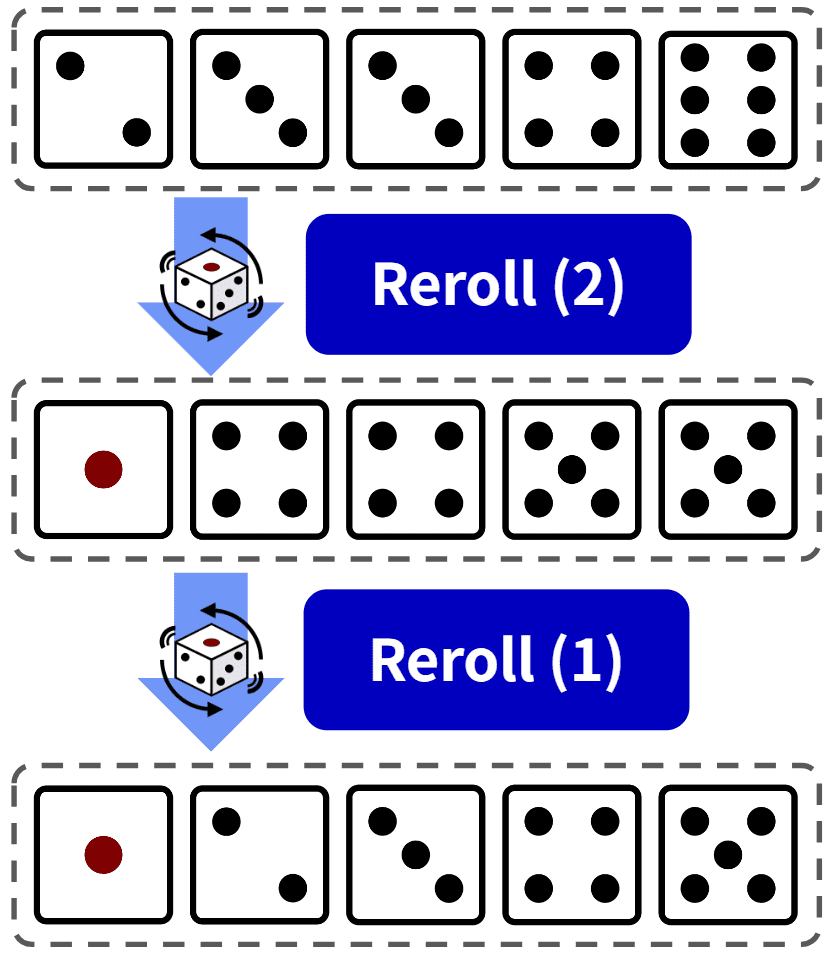

# How-to play the dice game "FUNE"

This manual is in English, the **Japanese version** is [here](./how-to-play-ja.md).

## About This Game

This game is based on the public domain dice game **Yacht**. Other similar games include **Yahtzee**, **Yatzy** and **Poker dice**. Most of the rules are based on these games, but some changes have been made as [house rules](#differences-from-other-dice-games).

In this game, you compete against an opponent for the total score. To get points, you need to make a combination using 5 dice. The number of rerolls is limited, and you cannot reuse a combination once selected. Therefore, this game requires both **luck and strategy**.

## Screen Operations

### Main Screen

Landscape mode

Portrait mode

| No. | Name                | Description                                    |
|:---:|:--------------------|:-----------------------------------------------|
| 1   | Information Button  | Displays various informations such as game description and setting. |
| 2   | Enemy Select        | Allows you to choose the type of enemy. If you change it, you have to press the `Reset Button`. |
| 3   | Reset Button        | Resets the game (applies enemy selection if specified). |
| 4   | Score Space         | Displays the scores of each unit.               |
| 5   | Score Button        | Displays a detailed score dialog when pressed.  |
| 6   | Unit Name           | Name of the player or the opponent.            |
| 7   | Dices               | Dices to make combinations. You can click to lock the dice. |
| 8   | Reroll Button       | Rerolls (unlocked) dices. This button can be used up to twice per turn. |
| 9   | Combination Select  | Allows you to choose a combination in the format "Combination: Points". |
| 10  | Confirm Button      | Confirms the turn with the combination selected. |

### Score Screen

When you press the "**5: Score Button**" in [main screen](#main-screen), a score dialog will be enpanded.

| No. | Name             | Description                                    |
|:---:|:-----------------|:-----------------------------------------------|
| 1   | Close Button     | Closes the dialog                              |
| 2   | Bonus Conditions | Displays the number of points required for the score bonus and the current score |
| 3   | Score Table      | Table of points and combinations. Blanks indicate unconfirmed states |

## Basic Flow

### About the game as a whole

In this game, there are **13 conbinations** using five dices, and **1 bonus** that depends on the upper section score.

Players and opponents aim for one of these combinations each turn.

Once a combination is confirmed, it cannot be changed, even if a higher score is achieved in later turns.

The game ends after 13 turns, which means the chart of combinations is filled. And then, a winner is the one who got a higher score.

In addition to the combination that depend on 5 dices, the chart of combinations also has a **upper section bonus**. If the sum of the points in upper section is 63 or more, 35 points are added.

### Turn Flow

#### The flow of a turn

You can roll the dice up to 3 times in a turn.
The first roll is mandatory, and player can reroll up to 2 more times.

Rerolling is optional, so you are also possible to confirm a combination without rerolling.

When you select a combination from the dropdown box and press the "Confirm" button, the turn ends.

#### Dice Locking

Before rerolling dices, you can **lock** specific dice.

Locked dice will not be rerolled and will remain fixed.

*Note: Locked dice can be unlocked again.*

## Score

### Differences from Other Dice Games

The differences from similar dice games are as follows:

- The combination "FUNE" can only be achieved once.
- There is no joker rule.
- 'Upper Section Bonus' is based on the total points of the upper section.
- 'Short Straight' must be sequential number with four dices.
- 'Long Straight' must be `1-2-3-4-5` or `2-3-4-5-6`.
- 'Full House' must be the pattern "**Three Dice** and **One pair**", so `1-1-1-1-1` does not qualify.
- Multiple combinations can be achieved with the same dice value. For example, `1-1-1-1-2` qualifies for both **Four Dice** and **Three Dice** (see diagram below).

### List of Combinations

| Combination     | Description                                  | Points | Example (Points) |
|:----------------|:---------------------------------------------|:------:|:----------------------------|
| Ones            | Sum of the dices showing 1                    || ⚀⚀⚀⚁⚂ (3)                   |
| Twos            | Sum of the dices showing 2                    || ⚀⚁⚁⚁⚂ (6)                   |
| Threes          | Sum of the dices showing 3                    || ⚀⚁⚂⚂⚂ (9)                   |
| Fours           | Sum of the dices showing 4                    || ⚀⚁⚃⚃⚃ (12)                  |
| Fives           | Sum of the dices showing 5                    || ⚀⚁⚄⚄⚄ (15)                  |
| Sixes           | Sum of the dices showing 6                    || ⚀⚁⚅⚅⚅ (18)                  |
| (Bonus)         | Achieved if the total points of 'Ones' to 'Sixes' are 63 or more | 35 |           |
| Three Dice      | At least three dices showing the same number  | Sum of all dices | ⚀⚀⚀⚁⚂ (8)      |
| Four Dice       | At least four dices showing the same number   | Sum of all dices | ⚁⚃⚃⚃⚃ (18)     |
| FUNE            | All dices showing the same number             | 50     | ⚀⚀⚀⚀⚀ (50)                 |
| Full House      | 'Three Dice' and a pair                   | 35     | ⚀⚀⚅⚅⚅ (35)                |
| Short Straight  | Four sequential number with four dices        | 30     | ⚁⚂⚃⚄⚄ (30)                |
| Long Straight   | Five sequential number with all dices         | 40     | ⚁⚂⚃⚄⚅ (40)                |
| Choice          | Any combination                              | Sum of all dices | ⚀⚀⚃⚄⚅ (17) |

#### Ones to Sixes

**Achieved if the dice include the specified number.** The score is the sum of the specified number.

For example, with the dice value "1 1 1 2 3" (`⚀⚀⚀⚁⚂`), the score is 3 for "Ones" and 2 for "Twos". Since there are no 4, the score is 0 for "Fours".

#### Bonus

Achieved if **the total points of 'Ones' to 'Sixes' are 63 or more.** If achieved, 35 points are added; if not, 0 points.

The number **63** means that there are three or more dices in each combination.  
"Ones: 3" + "Twos: 6" + "Threes: 9" + "Fours: 12" + "Fives: 15" + "Sixes: 18" = 63

#### Three Dice (Three of a Kind)

Achieved if there are **at least three dices showing the same number.** The score is the sum of all dices.

For example, with the dice value "1 1 1 2 3" (`⚀⚀⚀⚁⚂`), the score is 8 points for "Three Dice".

#### Four Dice (Four of a Kind)

Achieved if there are **at least four dices showing the same number.** The score is the sum of all dices.

For example, with the dice value "2 4 4 4 4" (`⚁⚃⚃⚃⚃`), the score is 18 points for "Four Dice". It can also be scored as "Three Dice" with the same score of 18 points.

#### FUNE

Achieved if **all dices show the same number.** The score is 50 points regardless of the dices.

For example, with the dice value "1 1 1 1 1" (`⚀⚀⚀⚀⚀`), the score is 50 points for "FUNE".

#### Full House

Achieved if the dices show a combination of **'Three Dice' and one pair** (e.g.,`AAA` `BB` or `AA` `BBB`, where `A` and `B` are different). The score is 35 points regardless of the dices.

For example, with the dice value "1 1 6 6 6" (`⚀⚀⚅⚅⚅`), the score is 35 points for "Full House". However, with "1 1 1 1 1" (`⚀⚀⚀⚀⚀`), "Full House" is not achieved as the dice value does not consist of two different numbers.

#### Short Straight

Achieved if **four dices** show a sequential pattern (e.g., "1 2 3 4", "2 3 4 5", "3 4 5 6"). The score is 30 points regardless of the dices.

For example, with the dice value "2 3 4 5 5" (`⚁⚂⚃⚄⚄`), the score is 30 points for "Short Straight".

#### Long Straight

Achieved if **all dices** show a sequential pattern. The score is 40 points regardless of the dices.

"Long Straight" is achieved with "1 2 3 4 5" (`⚀⚁⚂⚃⚄`) or "2 3 4 5 6" (`⚁⚂⚃⚄⚅`).

#### Choice

Achieved with **any combination** of dices. The score is the sum of all dices.

For example, with the dice value "1 1 4 5 6" (`⚀⚀⚃⚄⚅`), the score is 17 points for "Choice".
