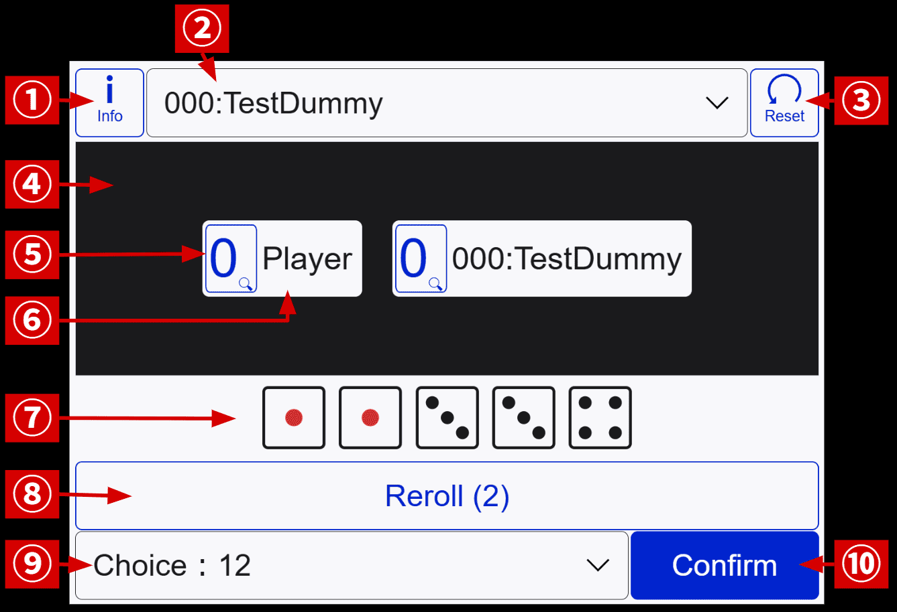

# How-to play the dice game "FUNE"

This manual is in English, the **Japanese version** is [here](./how-to-play-ja.md).

## About This Game

This game is based on the public domain dice game **Yacht**. Other similar games include **Yahtzee**, **Yatzy** and **Poker dice**. Most of the rules are based on these games, but some changes have been made as [house rules](#about-this-game).
<!--TODO: modify link-->

In this game, you compete against an opponent for the total score. To get points, you need to make a combination using 5 dice. The number of rerolls is limited, and you cannot reuse a combination once selected. Therefore, this game requires both **luck and strategy**.

## Screen Operations

### Main Screen

Landscape mode

Portrait mode

<!-- TODO:Change picture `confirm` button, and modify `howto-play-ja.md` -->

| No. | Name                | Description                                    |
|:---:|:--------------------|:-----------------------------------------------|
| 1   | Information Button  | Displays various informations such as game description and setting. |
| 2   | Enemy Select        | Allows you to choose the type of enemy. If you change it, you have to press the `Reset Button`. |
| 3   | Reset Button        | Resets the game (applies enemy selection if specified). |
| 4   | Score Space         | Displays the scores of each unit.               |
| 5   | Score Button        | Displays a detailed score dialog when pressed.  |
| 6   | Unit Name           | Name of the player or the opponent.            |
| 7   | Dices               | Dices to make combinations. You can click to lock the dice. |
| 8   | Reroll Button       | Rerolls (unlocked) dices. This button can be used up to twice per turn. |
| 9   | Combination Select  | Allows you to choose a combination in the format "Combination: Points". |
| 10  | Confirm Button      | Confirms the turn with the combination selected. |
