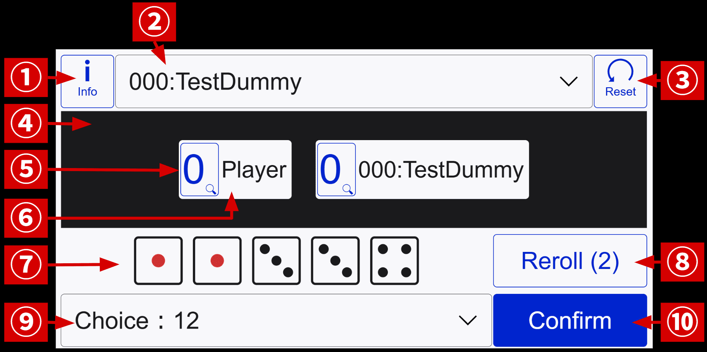

# ダイスゲーム FUNE の遊び方

こちらの説明書は日本語版です、英語版は[こちら](./how-to-play-en.md)

This manual is in Japanese, the English version is [here](./how-to-play-en.md).

## このゲームについて

これは、パブリックドメインのダイスゲーム**ヨット**（Yacht）を基にしたゲームになります。似たゲームとしては、他に**ヤッツィー**（Yahtzee, Yatzy）、**ポーカーダイス**（Poker dice）などがあります。ルールの大部分はこれらのゲームに準じていますが、[ハウスルール](#他のダイスゲームと違う部分について) としていくつかの変更が加えられています。

このゲームは、プレイヤーである自分と敵とで、スコアの合計値を競うゲームです。ポイントを得るには、5つのダイスを使って役を作る必要があります。振り直しの回数には制限があり、また一度選択した役を再使用することはできません。そのため このゲームでは、**運と戦略性**が求められます。

## 画面操作

### メイン画面

横画面時

縦画面時

|番号|名前|説明|
|:---:|:---|:---|
|1|インフォメーションボタン|ゲーム説明などの各種情報ダイアログを表示する|
|2|敵セレクト|敵のタイプを選択できる、選択後にリセットボタンを押すと適用|
|3|リセットボタン|（敵選択欄を指定した場合は反映した上で）ゲームを初期化する|
|4|スコアスペース|各ユニットのスコアを表示するスペース|
|5|得点ボタン|ユニットの得点、押下すると詳細ダイアログを表示|
|6|ユニット名|プレイヤーや敵の名前|
|7|ダイス|役を作成するためのダイス、クリックするとロックできる|
|8|振るボタン|押すと（アンロック状態の）ダイスを振り直す、１ターンに２回まで使用可能|
|9|役セレクト|「役名：点数」の形式で、役を選択できる|
|10|決定ボタン|押すと 選択した役で、そのターンを確定する|

### スコア画面

上記「**5:得点ボタン**」を押すと、スコアを表示するダイアログが展開されます。

|番号|名前|説明|
|:---:|:---|:---|
|1|閉じるボタン|押すとダイアログを格納できる|
|2|ボーナス条件|スコアボーナスに必要な点数と現在の点数を表す|
|3|スコア表|点数と役名の表、空欄は未確定の状態を表す|

## 基本的な流れ

### ゲーム全体について

このゲームでは、5つのダイスを使った特定の出目の時に成立する役が **13 個**、それとは別にボーナスが **1** 個あります。

プレイヤーと敵ユニットは、1ターン毎に この役表のどれかを狙っていきます。

一度確定させた役は変更不可能になります。もし後のターンで、より高得点になる出目が出た場合でも、変更することはできません。

役表全てが埋まる 13 ターンでゲームは終了となります。そして その時のスコアが高い方が勝者です。

役表にはダイスによる役とは別に、**セクションボーナス**というものがあります。これは「1の目」〜「6の目」までで、**その合計値が63点以上**のときに成立します。成立時は 35 点が加算されます。

### ターンについて

#### ターン全体の流れについて

1ターンにダイスは最大3回振ることができます。
最初の1回は強制で、プレイヤーはそこから2回まで振りなおすことができます。

振りなおしは任意なので、一度も振りなおしせず確定させることも可能です。

役をセレクトボックスから指定し、「決定」ボタンで役を確定させると、そのターンは終了します。

#### ダイスロックについて

振りなおす際、特定のダイスに**ロックをかける**ことができます。

ロック状態のダイスは、振りなおしの対象にならず、固定されたままとなります。

*※一度ロックしたダイスは、再度ロックを外すことも可能です。*

## スコア

### 他のダイスゲームと違う部分について

下記が、類似のダイスゲームと違う箇所になります。

- フネの成立は 1度のみです
- （上記より）ジョーカールールは有りません
- アッパーセクションの合計値によって、スコアボーナスが発生します
- ショートストレートは、4つのダイスが連番の関係になれば成立します
- ロングストレートは、`1-2-3-4-5`, `2-3-4-5-6` の出目で成立します
- フルハウスは「3組＋2組」のパターンになる必要があり、`1-1-1-1-1` では成立しません
- ダイス値によって複数の役が成立し得ます、例えば `1-1-1-1-2` はフォーダイスとスリーダイス両方を満たします（下図参照）

### 役の一覧

|役名|役の説明|得点|例（括弧内は得点）|
|:---|:---|:---:|:---|
|1の目||1の目の合計|⚀⚀⚀⚁⚂(3)|
|2の目||2の目の合計|⚀⚁⚁⚁⚂(6)|
|3の目||3の目の合計|⚀⚁⚂⚂⚂(9)|
|4の目||4の目の合計|⚀⚁⚃⚃⚃(12)|
|5の目||5の目の合計|⚀⚁⚄⚄⚄(15)|
|6の目||6の目の合計|⚀⚁⚅⚅⚅(18)|
|（ボーナス）|上記**1〜6の目までの合計値が63以上**で成立|35||
|スリーダイス|同じ目が3つ揃った場合に成立|全ダイスの合計|⚀⚀⚀⚁⚂(8)|
|フォーダイス|同じ目が3つ揃った場合に成立|全ダイスの合計|⚁⚃⚃⚃⚃(18)|
|フネ|全てのダイスが同じ目で成立|50|⚀⚀⚀⚀⚀(50)|
|フルハウス|同じ目が3つと2つで揃った場合に成立|35|⚀⚀⚅⚅⚅(35)|
|ショートストレート|連続した4つの目で成立|30|⚁⚂⚃⚄⚄(30)|
|ロングストレート|連続した5つの目で成立|40|⚁⚂⚃⚄⚅(40)|
|チョイス|いかなる状態でも成立|全ダイスの合計|⚀⚀⚃⚄⚅(17)|

#### 1の目〜6の目

**その出目がダイスの中に含まれていれば成立**します。得点は、その出目の合計値となります。

例えば「**1 1 1 2 3**（`⚀⚀⚀⚁⚂`）」の出目の場合、「1の目」なら 3 点に、「2の目」なら 2 点になります。ダイスに 4 は存在しないので、「4の目」の場合は不成立で 0 点です。

#### ボーナス

上記の「1の目〜6の目」の**合計点が 63 点以上の場合**に成立します。成立した場合は 35 点が加算され、不成立の場合は 0 点です。

この **63** という数値は、各役でダイスが3つ以上存在する状態を指します（「1の目: 3」+「2の目: 6」+「3の目: 9」+「4の目: 12」+「5の目: 15」+「6の目: 18」＝ 63）

#### スリーダイス

（少なくとも）**3つ以上の出目が同じである場合**に成立します。得点は、全ダイスの合計値です。

例えば「**1 1 1 2 3**（`⚀⚀⚀⚁⚂`）」の出目の場合、「スリーダイス」なら全ダイスの合計値 8 が得点となります。

#### フォーダイス

（少なくとも）**4つ以上の出目が同じである場合**に成立します。得点は、全ダイスの合計値です。

例えば「**2 4 4 4 4**（`⚁⚃⚃⚃⚃`）」の出目の場合、「フォーダイス」なら全ダイスの合計値 18 が得点となります。 「フォーダイス」を使わず「スリーダイス」にすることも可能で、その場合の得点は同じ 18 点になります。

#### フネ

**全てのダイスが同じ出目の場合**に成立します。得点は、出目に関わらず 50 点となります。

例えば「**1 1 1 1 1**（`⚀⚀⚀⚀⚀`）」の出目の場合、「フネ」が成立し 50 点を獲得できます。

#### フルハウス

組み合わせ「`AAA` `BB`」または「`AA` `BBB`」（出目 `A` と `B` は違うもの）のように、ダイス値が 2種類で構成され、それぞれの個数が３＋２である場合に成立します。得点は、出目に関わらず 35 点となります。

例えば「**1 1 6 6 6**（`⚀⚀⚅⚅⚅`）」の出目の場合、「フルハウス」が成立し 35 点を獲得できます。一方、「**1 1 1 1 1**（`⚀⚀⚀⚀⚀`）」はダイス値が2種類で構成されないので、「フルハウス」は不成立となります。

#### ショートストレート

ダイスの内（少なくとも）4つが「**1 2 3 4**」「**2 3 4 5**」「**3 4 5 6**」と、連番になれば成立します。得点は、出目に関わらず 30 点です。

例えば「**2 3 4 5 5**（`⚁⚂⚃⚄⚄`）」の場合、「**2 3 4 5**」で連番になっているので「ショートストレート」が成立します。

#### ロングストレート

ダイス全てで連番になれば成立します。得点は、出目に関わらず 40 点です。

ロングストレートは、「**1 2 3 4 5**（`⚀⚁⚂⚃⚄`）」「**2 3 4 5 6**（`⚁⚂⚃⚄⚅`）」のどちらかでしか成立しません。

#### チョイス

どのような状態でも成立します。得点は、全ダイスの合計値です。

例えば「**1 1 4 5 6**（`⚀⚀⚃⚄⚅`）」の場合、「チョイス」を選択するとダイス合計値 17 が得点となります。
